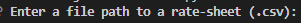

# Loan Qualifier App

This is a loan qualifier app that allows the user to input their financial information and recieve a list of loans that they are qualified for.

---

## Technologies

The technologies used to make this project possible were importing the sys, fire, csv, and questionary libraries.  This can be ran through both VS Code and Git Bash on Windows 11 or 10.

This program also uses Python 3.7 or above.

* [fire](https://github.com/google/python-fire) - For the command line interface, help page, and entrypoint.

* [questionary](https://github.com/tmbo/questionary) - For interactive user prompts and dialogs

---

## Installation Guide

Make sure to install fire & questionary before running:

```Git Bash/VS Code Terminal
pip install fire

pip install questionary
 
```

---

## Usage

To use the program you'll need to run the follow command in your terminal:

```
python app.py

```

After you launch your first question should be this:



---

## Contributors

This was an effort made possible by the teachings of the wonderful instructor Firas, along with contributions by James White.

---

## License

You may use this source code as you need to.
